# Architecture

## Overview

AWS Static Site plugin deploys static websites to AWS using S3 for storage, CloudFront for CDN, ACM for SSL certificates, and Route53 for DNS management.

## Components

### S3 Bucket

The S3 bucket stores all static files:

- **Private access** - No public bucket policy
- **Origin Access Control** - CloudFront accesses via OAC
- **Versioning** - Optional for rollback capability
- **Cache headers** - Set during upload for optimal caching

### CloudFront Distribution

CloudFront provides global CDN capabilities:

| Feature | Configuration |
|---------|---------------|
| Origin | S3 bucket via OAC |
| Price Class | PriceClass_100 (default) |
| HTTP/2 | Enabled |
| IPv6 | Enabled |
| Compression | Gzip/Brotli |
| Default TTL | 86400 (1 day) |

### ACM Certificate

SSL certificates are provisioned in us-east-1 (required for CloudFront):

- **DNS validation** - Automatic via Route53
- **Auto-renewal** - Managed by AWS
- **Wildcard** - Optional for subdomains

### Route53 DNS

DNS records connect the custom domain to CloudFront:

- **A Record (Alias)** - Points to CloudFront distribution
- **AAAA Record** - IPv6 support (optional)
- **Validation CNAME** - For ACM certificate validation

## Diagrams

### Architecture Overview



### Deployment Workflow



## Data Flow

1. **User Request**: Browser requests https://example.com
2. **DNS Resolution**: Route53 resolves to CloudFront
3. **Edge Location**: Request hits nearest CloudFront edge
4. **Cache Check**: CloudFront checks edge cache
5. **Origin Fetch**: On cache miss, fetch from S3 via OAC
6. **Response**: Content served with appropriate cache headers

## Caching Strategy

### Static Assets (CSS, JS, images)
```
Cache-Control: max-age=31536000, immutable
```
- Cached for 1 year
- Use versioned filenames for cache busting

### HTML Files
```
Cache-Control: max-age=3600
```
- Cached for 1 hour
- Allows quick content updates

### API Responses (if applicable)
```
Cache-Control: no-cache
```
- Always fetch fresh

## Security Architecture

```
┌─────────────────────────────────────────────────────────┐
│                    Internet                             │
└─────────────────────────────────────────────────────────┘
                          │
                          ▼ HTTPS (TLS 1.2+)
┌─────────────────────────────────────────────────────────┐
│                   CloudFront                            │
│  ┌──────────────┐  ┌──────────────┐  ┌──────────────┐  │
│  │  SSL/TLS     │  │  Edge Cache  │  │    Gzip      │  │
│  └──────────────┘  └──────────────┘  └──────────────┘  │
└─────────────────────────────────────────────────────────┘
                          │
                          ▼ Origin Access Control
┌─────────────────────────────────────────────────────────┐
│                      S3 Bucket                          │
│              (Private, No Public Access)                │
└─────────────────────────────────────────────────────────┘
```

## Multi-Environment Architecture

Each environment maintains isolated resources:

```
Production (prod)
├── S3: my-site-prod-static-site
├── CloudFront: E1PROD...
├── ACM: www.example.com
└── Route53: www.example.com → CloudFront

Staging (staging)
├── S3: my-site-staging-static-site
├── CloudFront: E1STAGING...
├── ACM: staging.example.com
└── Route53: staging.example.com → CloudFront

Development (dev)
├── S3: my-site-dev-static-site
├── CloudFront: E1DEV...
├── ACM: dev.example.com
└── Route53: dev.example.com → CloudFront
```
